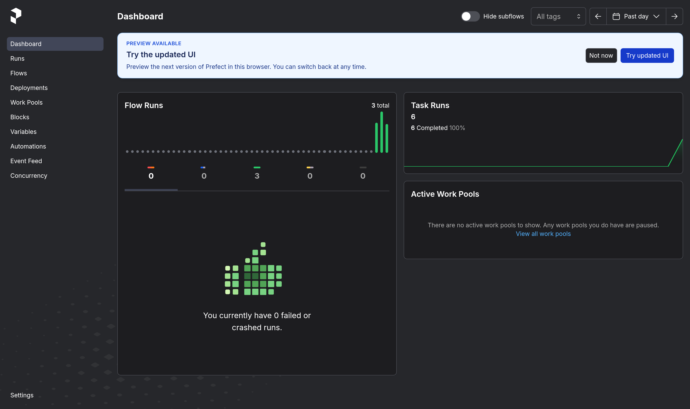
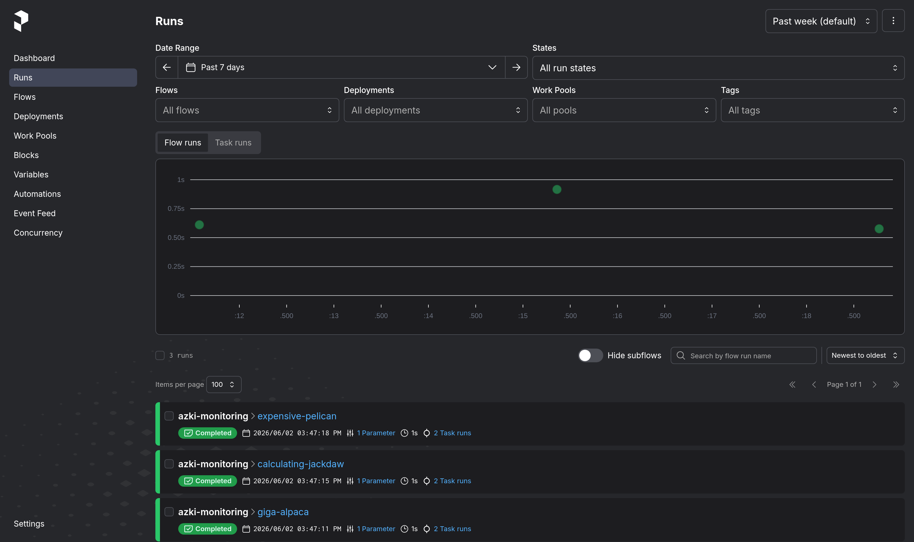
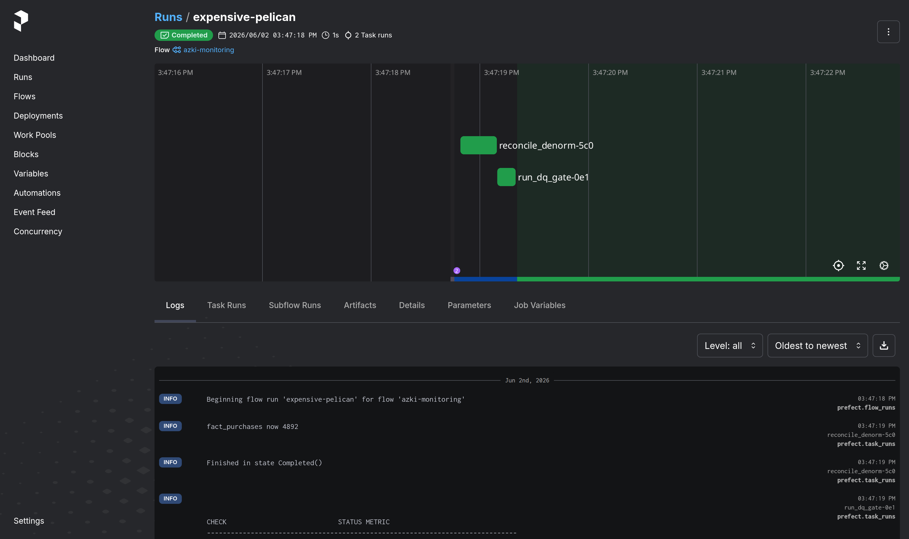

# Azki — Senior Data Engineer Hiring Task

An end-to-end analytics pipeline that takes raw **user events** and a **users
table**, and turns them into **query-ready tables in ClickHouse** — aggregates
for dashboards and a wide, denormalized purchase table for analytics/ML. The
whole thing runs locally with Docker Compose and is driven by a single Python
CLI (`python -m azki …`).

> The provided dataset is **confidential** and is git-ignored. Drop `users.csv`
> and `user_events.csv` into `data/` before running (see [`data/README.md`](data/README.md)).

---

## 1. The big picture (in plain terms)

Think of it as an assembly line with three stations:

```
   ┌─────────────┐        ┌──────────┐        ┌────────────────────────────────┐
   │  RAW INPUT  │        │ TRANSPORT│        │        WAREHOUSE (ClickHouse)  │
   └─────────────┘        └──────────┘        └────────────────────────────────┘

 user_events.csv ─► producer ─► Kafka topic ─► Kafka engine ─► enrich ─► events_enriched
                                  (user_events)                 ▲          │
                                                                │          ├─► events_agg_daily   ─► dashboards
   users.csv ─► MySQL ─────────► users_dict (lookup) ───────────┘          │   (count / sum / avg)
                                                                           │
                                4 product tables + financial ──► join ─────┴─► fact_purchases     ─► analytics / ML
                                (third, body, medical, fire)                   (one wide row per purchase)
```

**Walkthrough, step by step:**

1. **Events come in.** A small producer reads `user_events.csv` and streams each
   row into a **Kafka** topic (keyed by `user_id`, so one user's events stay in
   order). Kafka is the buffer between "stuff happening" and "stuff being
   processed" — if the warehouse is slow or restarts, events wait safely in the
   topic.

2. **The warehouse pulls events itself.** ClickHouse has a built-in **Kafka
   engine** table that reads the topic. We never store rows there; it's just the
   mouth of the pipe.

3. **Each event gets enriched.** As events arrive, a **materialized view** looks
   up the user's `city`/`device_type`/`signup_date` from `users_dict` — an
   in-memory copy of the MySQL `users` table — and writes the combined row into
   **`events_enriched`** (the durable, queryable "raw truth" layer). This lookup
   *is* the events↔users join the task asks for, done as a fast hash lookup
   instead of a heavy join.

4. **Two things are built automatically from `events_enriched`:**
   - **`events_agg_daily`** — pre-computed `count / unique users / sum / avg`
     per day × channel × city × device × event type. Dashboards read tiny
     summary rows instead of scanning millions of events.
   - **`fact_purchases`** — for every `purchase` event, we attach its order
     details. Orders live in 5 "production" tables (4 product lines —
     `third / body / medical / fire` — plus a shared `financial_order`); a view
     `UNION`s the products together and a materialized view `JOIN`s them onto the
     purchase, producing **one wide, ready-to-use row per purchase**.

5. **A safety net for late data.** The streaming join only sees orders that
   already exist when a purchase arrives. A scheduled, **idempotent reconcile**
   step backfills any purchases whose order showed up late — so the table is
   eventually complete without ever double-counting.

That's the core. Everything else — Kafka Connect, Schema Registry, the Spark
backfill, Prefect scheduling, the data-quality gate — supports or hardens this
spine. The full diagram is in [`docs/architecture.md`](docs/architecture.md) and
the deeper rationale in [`docs/technical-report.md`](docs/technical-report.md).

---

## 2. Quick start

```bash
# 0. put the confidential dataset in place:
#      data/users.csv   data/user_events.csv

# 1. install deps (only needed for the producer/orchestration/backfill/tests;
#    the CLI itself is pure stdlib). A virtualenv is recommended:
pip install -r requirements.txt        # or: pip install -r requirements.lock

# 2. run the whole happy path from scratch:
python -m azki demo
#   = up → init → seed → produce → reconcile → verify
```

Or step through it:

```bash
python -m azki up          # start kafka + mysql + clickhouse (fails fast if data missing)
python -m azki init        # create dictionary, Kafka source, MVs, tables
python -m azki seed        # generate + load the synthetic order tables (Part 2)
python -m azki produce     # stream user_events.csv into Kafka
python -m azki reconcile   # gap-fill late-arriving orders into fact_purchases
python -m azki verify      # show row counts + sample aggregates
python -m azki dq          # run the data-quality gate
python -m azki apply-opt   # Part 2 performance optimizations (projections, skip indexes)
python -m azki apply-gov   # Part 2 governance (roles, masked view, quotas)
```

> **Why a CLI and not a Makefile?** The original used `make` for everything,
> which turned the Makefile into the de-facto application logic. The pipeline is
> now a small, testable Python package (`azki/`); the CLI is the single
> operational surface, talks to ClickHouse over HTTP (so the same commands work
> on the host, in CI, or inside a container), and reads every credential from
> `.env`.

---

## 3. CLI command reference

| Command | What it does |
|---|---|
| `azki up` | Start core stack (Kafka, MySQL, ClickHouse); wait for health |
| `azki up-bonus` | Start the full stack incl. Schema Registry, Connect, Kafka-UI |
| `azki orchestrate` | Start Prefect server + UI + scheduled monitoring flow (`:4200`) |
| `azki down` / `azki clean` | Stop containers / stop + wipe volumes |
| `azki logs` | Tail ClickHouse + Kafka logs |
| `azki init` | Create the dictionary, Kafka source, MVs, and tables |
| `azki seed` | Generate + load the 5 synthetic order tables (Part 2) |
| `azki produce` | Stream `user_events.csv` into Kafka |
| `azki verify` | Row counts + sample aggregates from ClickHouse |
| `azki dq` | Run the data-quality gate (non-zero exit on FAIL) |
| `azki reconcile` | Idempotently gap-fill `fact_purchases` for late orders |
| `azki apply-opt` / `azki apply-gov` | Part 2 performance / governance SQL |
| `azki connect-register` | Register the Debezium + ClickHouse Connect connectors |
| `azki backfill START END` | Run the Spark backfill for a date window |
| `azki demo` | Full happy path end-to-end |

Run `python -m azki <command> --help` for per-command flags. All commands read
connection settings/credentials from `.env`.

---

## 4. How it maps to the task

| Part | Where |
|---|---|
| **Part 1** — ingest events from Kafka, join MySQL users, aggregate into ClickHouse | `azki produce` + `clickhouse/part1/` + `connect/` |
| **Part 2** — denormalized purchase table via MVs, performance, governance | `clickhouse/part2/` (+ `azki seed/reconcile/apply-opt/apply-gov`) |
| **Part 3** — data-quality plan + monitoring, Spark backfill (bonus) | `quality/` + `spark/` + `orchestration/` |

---

## 5. Design decisions & reasoning

**The events↔users join is a ClickHouse dictionary, not a streaming join.**
`users` is a small, slowly-changing dimension. Modeling it as a `HASHED()`
dictionary sourced from MySQL makes the join an in-memory `dictGet` evaluated at
insert time — O(1), no load on the OLTP database's hot path, and auto-refreshed
on a `LIFETIME`. A streaming-join engine (Spark/ksqlDB) would be a second
distributed system for what is fundamentally a hash lookup.

**ClickHouse's Kafka engine is the primary consume path.** Letting ClickHouse
read the topic directly means the join + aggregation happen *inside* the
warehouse via materialized views — no extra moving part in the hot path. The
Kafka Connect ClickHouse **sink** is also provided (bonus) as the alternative
you'd pick if the warehouse should stay a pure sink with DLQ error handling.

**Two modeling layers.** `events_enriched` (MergeTree) is the queryable raw
truth; `events_agg_daily` (AggregatingMergeTree) holds partial `count/uniq/
sum/avg` states kept up to date by a second MV. Dashboards read finalized states
in milliseconds instead of scanning the raw events.

**Streaming MV + idempotent reconcile for denormalization.** An INNER-JOIN MV
denormalizes a purchase the moment it's ingested (low latency), but can't see an
order that lands *later*. Pairing it with a scheduled, idempotent
`reconcile` (`INSERT … SELECT` guarded by `order_id`) guarantees eventual
completeness without double-counting. This is the production-correct pattern.

**Secrets come from `.env`, nowhere else.** No password is hardcoded in code,
SQL, or connector configs. Settings load from the environment, falling back to
the committed `.env` (throwaway local-demo creds only). The few files that must
embed a credential carry `${VAR}` placeholders that the CLI fills at apply time —
so in production the same env vars come from a secret manager and the code is
unchanged.

**Spark only where it earns its keep.** The live join is a hash lookup (handled
in ClickHouse). The Spark job is for **bounded batch backfill** of historical
data — shuffle-heavy dedup + broadcast enrichment, exactly Spark's strength.

---

## 6. Trade-offs (and what production would change)

| Here (task scope) | Production |
|---|---|
| Single-node Kafka (KRaft), ClickHouse, MySQL | Multi-broker Kafka; `ReplicatedMergeTree` + Keeper; replicated MySQL |
| `JSONEachRow` on the topic (human-debuggable) | Avro/Protobuf under Schema Registry for hard contracts |
| Producer script replays a CSV | Kafka Connect (Debezium) sources for both events and users CDC |
| `.env` committed with demo creds | Secret manager (Vault / cloud secrets) injecting the same vars |
| At-least-once into ClickHouse | Same; dedup via `ReplacingMergeTree` + natural keys (already in place) |
| Prefect runs flows locally / one container | Prefect server + workers; alerting on lag/freshness/parts |

---

## 7. Configuration

All settings live in [`.env`](.env) and are read by both the CLI and the
Compose stack. Real environment variables always override the file, so the same
code runs on the host (`localhost`) and inside Compose (service names like
`clickhouse:8123`, `kafka:9092`) with no changes.

| Variable | Meaning |
|---|---|
| `CLICKHOUSE_USER` / `CLICKHOUSE_PASSWORD` / `CLICKHOUSE_DB` | ClickHouse credentials |
| `CH_HOST` / `CH_PORT` | ClickHouse HTTP endpoint (localhost:8123 on host) |
| `MYSQL_USER` / `MYSQL_PASSWORD` / `MYSQL_ROOT_PASSWORD` / `MYSQL_DATABASE` | MySQL credentials |
| `KAFKA_TOPIC_EVENTS` / `KAFKA_BOOTSTRAP_HOST` / `KAFKA_BOOTSTRAP_INTERNAL` | Kafka topic + bootstrap endpoints |

---

## 8. Tests

A `pytest` suite covers the pure logic without needing the running stack:

```bash
pip install -r requirements.txt   # (or just: pip install pytest)
python -m pytest
```

It checks config precedence (`env > .env > default`), order generation
(determinism + purchase→order→financial join-completeness + reproducible seed),
the producer's type-casting transform, the DQ runner's pass/warn/fail
accounting, the SQL splitter and `${VAR}` renderer (incl. asserting the
dictionary SQL no longer contains a literal password), and the CLI parser. The
Spark `enrich_window` transform has its own tests, **auto-skipped when PySpark
isn't installed** (it runs in the Spark container or a Python ≤3.11 env).

---

## 9. Bonus paths

**Kafka Connect** (Debezium MySQL source + ClickHouse sink, creds injected from
`.env`):

```bash
python -m azki up-bonus
python -m azki connect-register
```

**Spark backfill** (Part 3 bonus) — reprocess a date window idempotently:

```bash
python -m azki backfill 2025-10-01 2025-10-07
```

**Orchestration** (Prefect — schedules, retries, UI; runs in Compose):

```bash
python -m azki orchestrate     # server + UI + scheduled monitoring flow at :4200
docker exec azki-prefect python orchestration/flows.py monitoring   # run now
```

### Orchestration in action (Prefect UI)

The `azki-monitoring` flow (reconcile → DQ gate) running on a schedule:





---

## 10. Repository layout

| Path | What |
|---|---|
| `azki/` | The Python package + CLI (config, ClickHouse client, orders, producer, quality, compose) |
| `docker-compose.yml` | Full stack (Kafka KRaft, Schema Registry, Connect, UI, MySQL, ClickHouse, Spark, Prefect) |
| `clickhouse/part1/` | Dictionary, Kafka source, enrichment MV (+ Kafka lineage), aggregates |
| `clickhouse/part2/` | Order tables, denormalized MV, reconciliation, optimizations, governance |
| `ingestion/mysql/` | MySQL schema + CSV load + CDC grants |
| `connect/` | Debezium source + ClickHouse sink configs (`${VAR}` creds) |
| `quality/` | DQ plan + SQL checks (parity, offset-continuity, ingestion-lag, …) |
| `spark/` | PySpark idempotent backfill + local validation |
| `orchestration/` | Prefect flows (ingest / monitoring / backfill) with retries + scheduling |
| `tests/` | pytest suite |
| `docs/` | Architecture diagram + 2–4 page technical report |
| `requirements.txt` / `requirements.lock` | Direct deps / pinned lock |

## Service endpoints

| Service | URL |
|---|---|
| ClickHouse HTTP | http://localhost:8123 |
| Kafka (host) | localhost:29092 |
| Schema Registry | http://localhost:8081 |
| Kafka Connect | http://localhost:8083 |
| Kafka-UI | http://localhost:8080 |
| MySQL | localhost:3306 |
| Prefect UI | http://localhost:4200 (`azki orchestrate`) |
