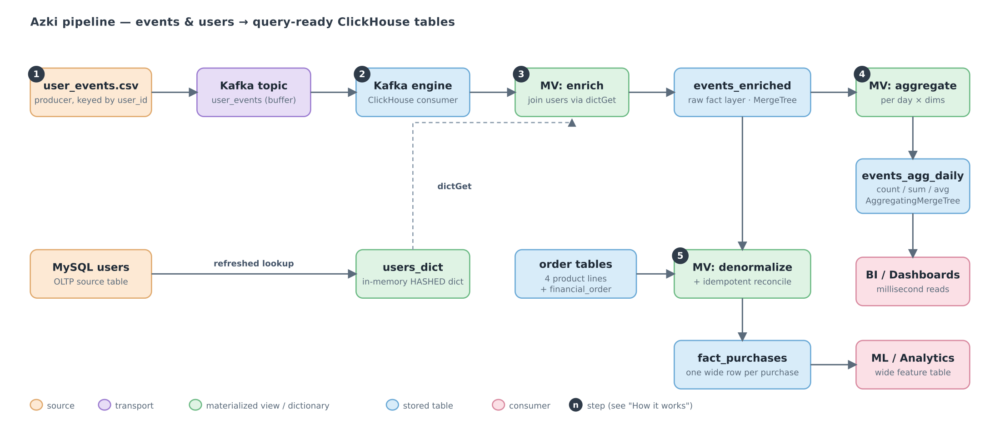
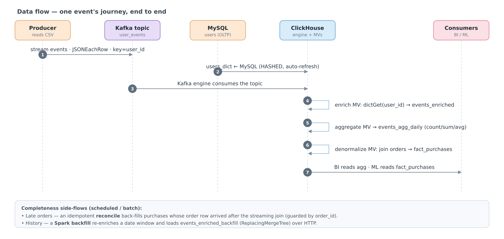
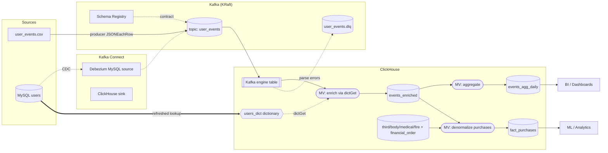

# Azki — Senior Data Engineer Hiring Task

An end-to-end analytics pipeline that takes raw **user events** and a **users
table** and turns them into **query-ready tables in ClickHouse** — aggregates
for dashboards and a wide, denormalized purchase table for analytics/ML. The
stack runs locally with Docker Compose; the data steps are driven by a small
Python CLI (`python -m azki …`).

---

## 1. Quick start

You need only **Docker** and **Python 3.11+** — no `pip install` required (the
CLI is pure stdlib; the producer streams through the Kafka container when
`confluent-kafka` isn't installed).

**First, add the dataset.** It's confidential and git-ignored, so drop the two
files into `data/` yourself (see [`data/README.md`](data/README.md)):

```
data/users.csv
data/user_events.csv
```

### A) The complete project — full stack + all bonuses

**1. Start the full stack.** Kafka Connect downloads its connector plugins on
first boot, so give it a minute or two to report healthy:

```bash
docker compose up -d
```

**2. Run the core pipeline** (init → seed → produce → reconcile → verify):

```bash
python -m azki demo
```

**3. Bonus — Kafka Connect** (Debezium MySQL→Kafka CDC source + ClickHouse sink).
Run any time after step 1 — it waits for Kafka Connect to finish installing its
plugins (~1–2 min on first boot):

```bash
python -m azki connect-register
```

**4. Bonus — Spark idempotent backfill** for a date window (the first run pulls
the ~1.5 GB Spark image):

```bash
python -m azki backfill 2025-10-01 2025-10-07
```

**5. Bonus — Prefect orchestration** (UI at http://localhost:4200; runs the
monitoring flow on a 5-minute schedule):

```bash
docker compose --profile orchestration up -d prefect
```

### B) Just the core project — no bonuses

Only ClickHouse + MySQL + Kafka, then the pipeline:

```bash
docker compose up -d clickhouse mysql kafka
python -m azki demo
```

`demo` prints a verification table at the end — 20,000 enriched events,
**0 UNKNOWN** (the MySQL users join landed), and `fact_purchases` matching the
purchase count. To run the pipeline one stage at a time instead (what each does
is in [§4](#4-cli-command-reference)):

```bash
python -m azki init
python -m azki seed
python -m azki produce
python -m azki reconcile
python -m azki verify
python -m azki dq
python -m azki apply-opt
python -m azki apply-gov
```

---

## 2. The big picture (in plain terms)

```
   ┌─────────────┐        ┌──────────┐        ┌────────────────────────────────┐
   │  RAW INPUT  │        │ TRANSPORT│        │        WAREHOUSE (ClickHouse)  │
   └─────────────┘        └──────────┘        └────────────────────────────────┘

 user_events.csv ─► producer ─► Kafka topic ─► Kafka engine ─► enrich ─► events_enriched
                                  (user_events)                 ▲          │
                                                                │          ├─► events_agg_daily   ─► dashboards
   users.csv ─► MySQL ─────────► users_dict (lookup) ───────────┘          │   (count / sum / avg)
                                                                           │
                                4 product tables + financial ──► join ─────┴─► fact_purchases     ─► analytics / ML
                                (third, body, medical, fire)                   (one wide row per purchase)
```

1. **Events come in.** A producer reads `user_events.csv` and streams each row
   into a **Kafka** topic, keyed by `user_id` so one user's events stay in
   order. Kafka buffers between producers and the warehouse.
2. **The warehouse pulls events.** ClickHouse's built-in **Kafka engine** table
   reads the topic — it's the mouth of the pipe, not storage.
3. **Each event gets enriched.** A materialized view looks up the user's
   `city`/`device_type`/`signup_date` from `users_dict` (an in-memory copy of
   the MySQL `users` table) and writes the combined row to **`events_enriched`**,
   the durable raw layer. This lookup is the events↔users join.
4. **Two tables build automatically from `events_enriched`:**
   - **`events_agg_daily`** — `count / unique users / sum / avg` per day ×
     channel × city × device × event type, for fast dashboards.
   - **`fact_purchases`** — for every `purchase` event, the order details are
     attached. Orders live in 5 tables (4 product lines + a shared
     `financial_order`); a view `UNION`s the products and a materialized view
     `JOIN`s them onto the purchase into one wide row.
5. **Late-data safety net.** The streaming join only sees orders that exist when
   a purchase arrives. A scheduled, idempotent `reconcile` backfills purchases
   whose order landed late — eventually complete, never double-counted.

---

## 3. System design

**Topology** — the components and how they connect. The numbered steps ①–⑤ match
the five steps in [§2](#2-the-big-picture-in-plain-terms):



**Data flow** — how a single event travels through the pipeline, plus the
late-order reconcile and Spark backfill side-flows:



If the images don't render in your Markdown viewer, open them directly under
[`docs/`](docs/) (`architecture.png` / `dataflow.png`, with `.svg` vector
sources); both are also embedded in [`docs/architecture.md`](docs/architecture.md).

<details>
<summary>Same diagram as Mermaid source (renders on GitHub)</summary>



</details>

| Component | Role |
|---|---|
| Producer | Replays `user_events.csv` into Kafka, keyed by `user_id` |
| Kafka (KRaft) | Event transport / buffer |
| Schema Registry | Topic contract (schema-drift defense) |
| MySQL | "Production" users table (OLTP source) |
| ClickHouse Kafka engine | Consumes the topic |
| `users_dict` | In-memory users lookup from MySQL (O(1) `dictGet`) |
| MV chain | enrich → aggregate → denormalize |
| `events_enriched` | Queryable raw fact layer |
| `events_agg_daily` | Pre-aggregated metrics (count/sum/avg) |
| `fact_purchases` | Denormalized purchases (events + order details) |
| reconcile | Idempotent gap-filler for late-arriving orders |
| Kafka Connect | Debezium source + ClickHouse sink (bonus path) |
| Prefect flows | ingest / monitoring / backfill orchestration |

The deeper write-up is in [`docs/architecture.md`](docs/architecture.md) and
[`docs/technical-report.md`](docs/technical-report.md).

---

## 4. CLI command reference

| Command | What it does |
|---|---|
| `azki init` | Create the dictionary, Kafka source, MVs, and tables |
| `azki reset` | Truncate the data tables (keep schema + `users_dict`) for a clean reload |
| `azki seed` | Generate + load the 5 synthetic order tables (Part 2) |
| `azki produce` | Stream `user_events.csv` into Kafka |
| `azki verify` | Row counts + sample aggregates from ClickHouse |
| `azki dq` | Run the data-quality gate (non-zero exit on FAIL) |
| `azki reconcile` | Idempotently gap-fill `fact_purchases` for late orders |
| `azki apply-opt` / `azki apply-gov` | Part 2 performance / governance SQL |
| `azki connect-register` | Register the Debezium + ClickHouse Connect connectors |
| `azki backfill START END` | Run the Spark backfill for a date window |
| `azki demo` | Full happy path: init → reset → seed → produce → reconcile → verify |

Run `python -m azki <command> --help` for per-command flags. All commands read
connection settings/credentials from `.env`.

`demo` resets the data tables first, so it's **idempotent** — re-running it on a
persisted stack always lands exactly 20,000 events / 4,892 purchases (ingestion
is at-least-once, so `produce`/`seed` on their own append; `reset` or `demo`
gives a clean reload). `reconcile` is idempotent by design.

---

## 5. How it maps to the task

| Part | Where |
|---|---|
| **Part 1** — ingest events from Kafka, join MySQL users, aggregate into ClickHouse | `azki produce` + `clickhouse/part1/` + `connect/` |
| **Part 2** — denormalized purchase table via MVs, performance, governance | `clickhouse/part2/` (+ `azki seed/reconcile/apply-opt/apply-gov`) |
| **Part 3** — data-quality plan + monitoring, Spark backfill (bonus) | `quality/` + `spark/` + `orchestration/` |

---

## 6. Design decisions & reasoning

**The events↔users join is a ClickHouse dictionary, not a streaming join.**
`users` is a small, slowly-changing dimension. As a `HASHED()` dictionary
sourced from MySQL, the join is an in-memory `dictGet` evaluated at insert
time — O(1), no load on the OLTP hot path, auto-refreshed on a `LIFETIME`. A
streaming-join engine would add a second distributed system for a hash lookup.

**ClickHouse's Kafka engine is the primary consume path.** Reading the topic
directly lets the join + aggregation happen inside the warehouse via
materialized views. The Kafka Connect ClickHouse **sink** is also provided as
the alternative for when the warehouse should stay a pure sink with a DLQ.

**Two modeling layers.** `events_enriched` (MergeTree) is the queryable raw
truth; `events_agg_daily` (AggregatingMergeTree) holds partial states kept up to
date by a second MV, so dashboards read finalized states in milliseconds.

**Streaming MV + idempotent reconcile for denormalization.** An INNER-JOIN MV
denormalizes a purchase at ingest (low latency) but can't see an order that
lands later. A scheduled, idempotent `reconcile` (guarded by `order_id`)
guarantees eventual completeness without double-counting.

**Secrets come from `.env`, nowhere else.** Settings load from the environment,
falling back to the committed `.env` (local-demo creds). Files that must embed a
credential carry `${VAR}` placeholders the CLI fills at apply time, so in
production the same env vars come from a secret manager unchanged.

**Spark only for backfill.** The live join is a hash lookup (in ClickHouse). The
Spark job handles bounded batch backfill of historical data — shuffle-heavy
dedup + broadcast enrichment.

---

## 7. Trade-offs (and what production would change)

| Here (task scope) | Production |
|---|---|
| Single-node Kafka (KRaft), ClickHouse, MySQL | Multi-broker Kafka; `ReplicatedMergeTree` + Keeper; replicated MySQL |
| `JSONEachRow` on the topic (human-debuggable) | Avro/Protobuf under Schema Registry for hard contracts |
| Producer replays a CSV | Kafka Connect (Debezium) sources for events and users CDC |
| `.env` with demo creds | Secret manager injecting the same vars |
| At-least-once into ClickHouse | Same; dedup via `ReplacingMergeTree` + natural keys |
| Prefect runs flows in one container | Prefect server + workers; alerting on lag/freshness/parts |

---

## 8. Configuration

All settings live in [`.env`](.env), read by both the CLI and Compose. Process
env vars override the file, so the same code runs on the host (`localhost`) and
inside Compose (service names like `clickhouse:8123`, `kafka:9092`).

| Variable | Meaning |
|---|---|
| `CLICKHOUSE_USER` / `CLICKHOUSE_PASSWORD` / `CLICKHOUSE_DB` | ClickHouse credentials |
| `CH_HOST` / `CH_PORT` | ClickHouse HTTP endpoint |
| `MYSQL_USER` / `MYSQL_PASSWORD` / `MYSQL_ROOT_PASSWORD` / `MYSQL_DATABASE` | MySQL credentials |
| `KAFKA_TOPIC_EVENTS` / `KAFKA_BOOTSTRAP_HOST` / `KAFKA_BOOTSTRAP_INTERNAL` | Kafka topic + bootstrap endpoints |

---

## 9. Tests

```bash
pip install pytest && python -m pytest
```

No working host pip? Run the same suite in a throwaway container:

```bash
docker run --rm -v "$PWD":/app -w /app python:3.11-slim sh -c "pip install -q pytest && python -m pytest"
```

The suite covers the pure logic without the running stack: config precedence,
order generation (determinism + join-completeness + reproducible seed), the
producer transform, the DQ runner's pass/warn/fail accounting, the SQL splitter
and `${VAR}` renderer (asserting the dictionary SQL holds no literal password),
and the CLI parser. The Spark `enrich_window` transform has its own tests,
auto-skipped when PySpark isn't installed.

---

## 10. Bonus paths

**Kafka Connect** (creds from `.env`):

```bash
docker compose up -d
python -m azki connect-register
```

This waits for Connect to finish installing its plugins, then registers two
connectors (both reach `RUNNING`):

- **Debezium MySQL source** — snapshots/streams the `users` table into the
  `azki.azki.users` topic (the CDC alternative to seeding the ClickHouse
  dictionary from MySQL directly).
- **ClickHouse sink (+ DLQ)** — consumes the `user_events` topic into
  `azki.user_events` (the "pure sink" alternative to the Kafka engine, which is
  the demo's primary path).

**Spark backfill** — reprocess a date window idempotently. Spark re-enriches and
de-duplicates the window on its natural key, then the rows are loaded into a
`ReplacingMergeTree` over HTTP (re-running the same window collapses duplicates
on merge):

```bash
python -m azki backfill 2025-10-01 2025-10-07
```

You can prove the transform alone (no ClickHouse load) inside the Spark
container with `spark/validate_backfill.py`.

**Orchestration** (Prefect — schedules, retries, UI at `:4200`):

```bash
docker compose --profile orchestration up -d prefect
docker exec azki-prefect python orchestration/flows.py monitoring
```

The `azki-monitoring` flow runs `reconcile → DQ gate` on a 5-minute schedule;
`azki-ingest` runs a full produce → wait → reconcile → DQ cycle; each task
retries and the DQ gate fails the run on any `FAIL`.

---

## 11. Repository layout

| Path | What |
|---|---|
| `azki/` | Python package + CLI (config, ClickHouse client, orders, producer, quality) |
| `docker-compose.yml` | Full stack (Kafka KRaft, Schema Registry, Connect, UI, MySQL, ClickHouse, Spark, Prefect) |
| `clickhouse/part1/` | Dictionary, Kafka source, enrichment MV, aggregates |
| `clickhouse/part2/` | Order tables, denormalized MV, reconciliation, optimizations, governance |
| `ingestion/mysql/` | MySQL schema + CSV load + CDC grants |
| `connect/` | Debezium source + ClickHouse sink configs (`${VAR}` creds) |
| `quality/` | DQ plan + SQL checks (parity, offset-continuity, ingestion-lag, …) |
| `spark/` | PySpark idempotent backfill + local validation |
| `orchestration/` | Prefect flows (ingest / monitoring / backfill) |
| `tests/` | pytest suite |
| `docs/` | Architecture diagram + technical report |
| `requirements.txt` / `requirements.lock` | Direct deps / pinned lock |

## Service endpoints

| Service | URL |
|---|---|
| ClickHouse HTTP | http://localhost:8123 |
| Kafka (host) | localhost:29092 |
| Schema Registry | http://localhost:8081 |
| Kafka Connect | http://localhost:8083 |
| Kafka-UI | http://localhost:8080 |
| MySQL | localhost:3306 |
| Prefect UI | http://localhost:4200 |
