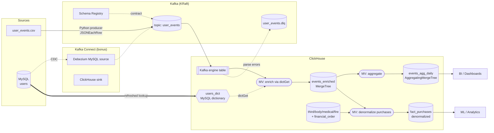

# Architecture

## End-to-end data flow

## Component roles

| Component | Role | Why |
|---|---|---|
| **Python producer** | Replays `user_events.csv` into Kafka, keyed by `user_id` | Decouples ingestion; per-user ordering; throttle to simulate live stream |
| **Kafka (KRaft)** | Event transport | No ZooKeeper; single-node for the task |
| **Schema Registry** | Topic contract | Schema-drift defense (Part 3) |
| **MySQL** | "Production" users table | The OLTP source to join against |
| **ClickHouse Kafka engine** | Topic consumer | Native, no extra service in the hot path |
| **`users_dict` dictionary** | In-memory users lookup from MySQL | O(1) `dictGet` join at insert time; auto-refresh |
| **MV chain** | enrich → aggregate → denormalize | Incremental, push-based transforms |
| **`events_enriched`** | Raw enriched fact layer | Queryable source of truth |
| **`events_agg_daily`** | Pre-aggregated metrics | count/sum/avg at dashboard speed |
| **`fact_purchases`** | Denormalized purchases | Part 2: events + order details, one wide row |
| **denorm reconcile** | Idempotent gap-filler | Closes late-arriving-order gaps the INNER-JOIN MV can't backfill |
| **Kafka Connect** | Debezium source + CH sink | Bonus: production-grade CDC + sink path |

## Why ClickHouse-native join (vs Spark / ksqlDB)

The join is a **stream-to-static-dimension lookup** (events ⨝ users). A
ClickHouse `dictGet` against a MySQL-backed dictionary does this in-process at
insert time — no extra cluster, no network hop to the OLTP DB on the hot path,
and the dimension auto-refreshes. Spark Structured Streaming or ksqlDB would add
a second distributed system for what is fundamentally a hash lookup. Spark still
earns its place for **batch backfill** (Part 3), where its strengths apply.
